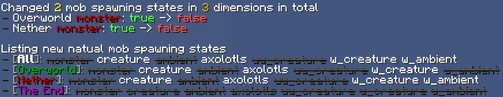

# Commands

## info

### world ticking_order

`/info world ticking_order`

Show the ticking order of current dimensions in the game

### world weather

`/info world weather`

Show weather properties of the world and organize it into a nice weather forecast

### server entity_id_counter

`/info server entity_id_counter`

Show the current value of the entity ID counter (`net.minecraft.world.entity.Entity#ENTITY_COUNTER`) of the server

### server server_tick_counter

`/info server server_tick_counter`

Show the current value of the server tick counter (`net.minecraft.server.MinecraftServer#getTickCount`) of the server


## lifetime

A tracker to track lifetime and spawn / removal reasons from all newly spawned and dead entities

This tracker is mostly used to debug mobfarms. It aims to track the process from mob starting affecting the mobcap to mob being removed from the mobcap. The spawning tracking part of it doesn't cover every kind of mob spawning reasons

Other than being removed from the world, if a mob becomes persistent for the first time like nametagged or item pickup, it will be marked as removal too. If a mob doesn't count towards the mobcap when it spawns, it will not be tracked

This tracker also tracks lifetime of items and xp orbs from mob and block drops as an additional functionality. Note that it doesn't track all item / xp orb spawning, so you'd better have a test before actually using it

Adding a `realtime` suffix to the command will turn the rate result from in-game time based to realtime based

Check rule [lifeTimeTrackerConsidersMobcap](rules.md#lifetimetrackerconsidersmobcap) for switching the strategy with mobs that don't count towards mobcap

### tracking

`/lifetime tracking [<start|stop|restart>]`

Control the lifetime tracker

Tracked entity types:
- All kinds of mob (MobEntity) which count towards mobcap or rule [lifeTimeTrackerConsidersMobcap](rules.md#lifetimetrackerconsidersmobcap) is false
- Item Entity
- Experience Orb Entity
- Vehicles, including minecarts and boats (and their variants)

Tracked entity spawn reasons
- Block drop (item only)
- Breeding
- `/summon` command
- Dropped from container (item only)
- Dispensed by block
- Spawned by item
- Jockey
- Jockey mount
- Natural spawning
- Enderman placed down a block (1.16+). Requires rule [lifeTimeTrackerConsidersMobcap](rules.md#lifetimetrackerconsidersmobcap) being set to true
- Player login (for its vehicle)
- Nether portal pigman spawning
- Spawned in raid as raider
- Slime division
- Spawned by spawner
- Be summoned by entity or block
- Dismounts from a vehicle (1.16+). Requires rule [lifeTimeTrackerConsidersMobcap](rules.md#lifetimetrackerconsidersmobcap) being set to true
- Zombie Reinforce
- Mob drop (item and xp orb only)
- Mob throw (item only)
- Mob conversion
- Status effect (e.g. oozing and infested in mc1.20.5+)
- Trans-dimension

Note that only entities that have been tracked spawning will be counted to the statistic

Tracked entity removal reasons
- Despawn, including immediately despawn, random despawn, difficulty despawn and timeout despawn
- Self-exploded (e.g. creeper)
- Collected up by hopper or hopper minecart (item only)
- Entity merged (item and xp orb only)
- Becomes persistent. Requires rule [lifeTimeTrackerConsidersMobcap](rules.md#lifetimetrackerconsidersmobcap) being set to true
- Enderman picked up a block (1.16+). Requires rule [lifeTimeTrackerConsidersMobcap](rules.md#lifetimetrackerconsidersmobcap) being set to true
- Player logout (for its vehicle)
- Rides on a vehicle (1.16+). Requires rule [lifeTimeTrackerConsidersMobcap](rules.md#lifetimetrackerconsidersmobcap) being set to true
- Entering void
- Picked up by player or mob (item and xp orb only)
- Mob conversion
- Damaged to death
- Trans-dimension
- Other (anything else not in the list). If some other important reason is not tracked, feel free to make a feature request issue

The definition of lifetime is: **The amount of spawning stage passing between entity spawning and entity removal**, in other words, how many gameticks does the entity counts towards mobcap. Technically the injection point for the passing spawning stage counter increment is right before the world recalculating the mobcap

Statistics are sorted by the proportion of the amount

### \<entity_type\>

`/lifetime <entity_type> [<life_time|removal|spawning>]`

Show the detail statistic of specific entity type. You can specify which part of the statistic will be output

For example, `/lifetime creeper` shows all statistic of creeper in detail, and `/lifetime creeper removal` only shows removal statistic of creeper in detail

### filter

```
/lifetime filter <entity_type> set <entity_selector>
/lifetime filter <entity_type> clear
```

Set an entity filter for given entity type. Use `global` as the `<entity_type>` to set filter globally

Entities need to be accepted by the related filter to be record by the lifetime tracker

Filter is input as an `@e` style Minecraft entity selector. e.g. `@e[distance=..100,nbt={Item:{id:"minecraft:oak_sapling"}}]`

Use `/lifetime filter` to display current activated filters

### recorder

Lifetime Data Recorder: writes spawn/removal events of every entity into files for later statistical analysis

| Command                      | Effect                                          |
|------------------------------|-------------------------------------------------|
| `/lifetime recorder`         | Shows the status of the data recorder           |
| `/lifetime recorder status`  | Same as above                                   |
| `/lifetime recorder reload`  | Reload the recorder configuration file          |
| `/lifetime recorder enable`  | Enable the data recorder and update the config  |
| `/lifetime recorder disable` | Disable the data recorder and update the config |

If the data recorder is enabled, recording will start the next time lifetime tracking (`/lifetime tracking`) begins

Recording stops when lifetime tracking is stopped or when the data recorder is disabled

:::note

Since the Lifetime Data Recorder writes files to the server, only the server owner has permission to operate it by default.  
To loosen the permission restriction, you can adjust it in the configuration file

:::

Config file path: `config/carpettisaddition/lifetime/recorder_config.json`

Default config with explanations:

```json
{
  // Whether the lifetime data recorder is enabled
  // Can be toggled via `/lifetime recorder [enable|disable]`
  "enabled": false,  
  
  // Extra permission level required to use `/lifetime recorder` commands
  "requiredPermissionLevel": 4,  // Minimum permission level required
  "consoleOrSinglePlayerOwnerOnly": true,  // If true, only the server console or singleplayer owner can use it
  
  // Output settings
  "outputDirectory": "config/carpettisaddition/lifetime/records",  // Output folder
  "maxOutputRecordCount": -1,       // Max record count per file. Recording pauses once exceeded
  "maxOutputFileBytes": 104857600,  // Max size per file (bytes). Recording pauses once exceeded
  "maxTotalOutputFileCount": 500,         // Max number of record files in the folder. No new records once exceeded
  "maxTotalOutputFileBytes": 1073741824,  // Max total size of record files in the folder. No new records once exceeded
  
  // Recording details
  "sampleRate": 1.0  // Sampling rate, a real number between 0 and 1
}
```

Output files are named as `rec_${yyyyMMddHHmmss}_${id}.jsonl`, e.g. `rec_20250818015654_1.jsonl`.
The format is JSON Lines (jsonl), with each line representing one record

JSON field description:

```json
{
  // Server info
  "serverTick": 704,   // MinecraftServer tick counter
  "gameTime": 483897,  // Game time of the Overworld
  
  // Event info
  "eventType": "removal",  // Event category: "spawning" or "removal"
  "eventId": "death",      // Specific event type (spawn reason / removal reason)
  "eventPosition": [156.55, 80.0, 567.45],  // Position where the event occurred (usually same as entity position)
  "eventData": {  // Extra data for the event; fields depend on event type, may be empty
    "damageSource": "player"  // e.g. for a "death" event, records the damage source
  },
  
  // Entity info
  "entityType": "minecraft:llama",  // Entity type
  "entityId": 159,  // Entity ID (network ID)
  "entityUuid": "9503642c-2d5f-4a27-9b91-c09853538397",  // Entity UUID
  "entityPosition": [156.55, 80.0, 567.45],  // Entity position
  "entityDimension": "minecraft:overworld",  // Entity dimension
  "entityLifetime": 190  // Entity lifetime (ticks)
}
```


## manipulate

Manipulate the world

### block

Manipulate blocks in the world

You can use the rule [manipulateBlockLimit](rules.md#manipulateblocklimit) to alternative the maximum amount of affected blocks

`/manipulate block <from> <to> [actions]`, where `<from>` and `<to>` are block positions consisting of `<x> <y> <z>`

#### execute

`/manipulate block <from> <to> execute [what]`

Execute a given game logic on the target block immediately

| Command                                                           | What to execute                | Include fluid |
|-------------------------------------------------------------------|--------------------------------|---------------|
| `/manipulate block <from> <to> execute block_event <type> <data>` | block event                    | ❌             |
| `/manipulate block <from> <to> execute precipitation_tick`        | precipitation tick (rain tick) | ❌             |
| `/manipulate block <from> <to> execute random_tick`               | random tick                    | ✔️            |
| `/manipulate block <from> <to> execute tile_tick`                 | tile tick                      | ✔️            |

If you need to schedule execution rather than execute immediately, you can take a look at the `/manipulate container` command

#### emit

`/manipulate block <from> <to> emit [what]`

Emit events like updates on given blocks immediately

| Command                                                 | What to emit      |
|---------------------------------------------------------|-------------------|
| `/manipulate block <from> <to> emit block_update`       | block update (NC) |
| `/manipulate block <from> <to> emit state_update`       | state update (PP) |
| `/manipulate block <from> <to> emit light_update`       | light update      |

### chunk

Manipulate chunks in the world

#### erase

Erase the given chunks, voiding them into a perimeter condition

:::danger

This action cannot be undone. Please back up and think twice before execute

:::

What it will erase:

- Blocks
- Entities
- Tile entities
- Block events
- Lighting

What it will not affect:

- Structures

| Command                                               | Effect                                                             |
|-------------------------------------------------------|--------------------------------------------------------------------|
| `/manipulate chunk erase current`                     | Erase the current chunk you are in                                 |
| `/manipulate chunk erase square\|chebyshev <radius>`  | Erase chunks in the given range (chebyshev distance)               |
| `/manipulate chunk erase circle\|euclidean  <radius>` | Erase chunks in the given range (euclidean distance)               |
| `/manipulate chunk erase at <chunkX> <chunkZ>`        | Erase the chunk at given position, the given chunk needs be loaded |

#### relight

Recalculate the lighting for the given chunk. This will trigger lighting updates for all blocks within the chunk

:::note

Currently, this command is achieved by checking lighting at all block positions inside given chunks, which is not that efficient

:::

| Command                                                 | Effect                                                               |
|---------------------------------------------------------|----------------------------------------------------------------------|
| `/manipulate chunk relight`                             | The same as `/manipulate chunk relight current`                      |
| `/manipulate chunk relight current`                     | Relight the current chunk you are in                                 |
| `/manipulate chunk relight square\|chebyshev <radius>`  | Relight chunks in the given range (chebyshev distance)               |
| `/manipulate chunk relight circle\|euclidean  <radius>` | Relight chunks in the given range (euclidean distance)               |
| `/manipulate chunk relight at <chunkX> <chunkZ>`        | Relight the chunk at given position, the given chunk needs be loaded |


### container

`/manipulate container`

Manipulate data structure containers of the world, including:

| Container name            | Command prefix | Support operations                                                   |
|---------------------------|----------------|----------------------------------------------------------------------|
| Entity list               | `entity`       | reverting, shuffling                                                 |
| Tickable tile entity list | `tileentity`   | reverting, shuffling, query overall / specified position information |
| Tile tick queue           | `tiletick`     | add item, remove items at position                                   |
| Block event queue         | `blockevent`   | add item, remove items at position                                   |

Command lists:

```
/manipulate container entity [revert|shuffle]
/manipulate container tileentity [query|revert|shuffle|statistic]
/manipulate container tiletick add <pos> <block> <delay> [<priority>]
/manipulate container tiletick remove <pos>
/manipulate container blockevent add <pos> <block> <type> <data>
/manipulate container blockevent remove <pos>
```

### entity

Manipulate target entities

`/manipulate entity <entity_selector> [actions]`

Command lists:

Set / Clear target entities custom name

```
/manipulate entity <target> rename <name_text>
/manipulate entity <target> rename clear
```

Query / Set target entities persistent tag state

```
/manipulate entity <target> persistent
/manipulate entity <target> persistent set <state>
```

Target entities vehicle logic control

```
/manipulate entity <target> mount <vehicle>
/manipulate entity <target> dismount
```

Target entities velocity logic control. `nan` and `inf` can be used as the velocity values

```
/manipulate entity <target> velocity [add|set] <x> <y> <z>
```


## speedtest

Test the network connection between the client and the server, including download / upload speed, and average ping

### help

```
/speedtest
```

Show some information of speed test command, including:

- A simple command description
- The current maximum test size
- The client support status

### download

```
/speedtest download [<size_mib>]
```

Test the download speed, i.e. traffic from the server to the client

Arguments:

- `size_mib`: The amount of speed test traffic. Unit: MiB. Default: 10

### upload

```
/speedtest upload [<size_mib>]
```

Test the upload speed, i.e. traffic from the client to the server

Arguments:

- `size_mib`: The amount of speed test traffic. Unit: MiB. Default: 10

### ping

```
/speedtest ping [<count>] [<interval>]
```

Test the ping between the server and the client for given amount of rounds

The server will send a ping to the client, then the client will send a pong back to the server. 
Then the ping for this round is the time interval between the server sending ping and receiving pong

Arguments:

- `count`: The amount of ping test rounds. Default: 4
- `interval`: The minimum interval between 2 pings. Unit: second. Default: 1

### abort

```
/speedtest abort [<size_mib>]
```

Abort the current ongoing test (download, upload or ping)


## raid

### list

`/raid list [<full>]`

List information of all current raids

### tracking

`/raid tracking [<start|stop|restart|realtime>]`

Start a raid tracking to gather statistics from ongoing raids


## raycast

`/raycast block <x1> <y1> <z1> <x2> <y2> <z2> [<shapeMode>] [<fluidMode>]`

Perform a block raycast from (x1, y1, z1) to (x2, y2, z2) with given shape mode and fluid mode, then show the raycast result

Argument `<shapeMode>` and `<fluidMode>` are optional. See below for their default values

Shape mode (see `net.minecraft.world.RaycastContext.ShapeType`):

- `collider` (default value)
- `outline`
- `visual` (mc1.16+)
- `falldamage_resetting` (mc1.18.2+)

Fluid mode (see `net.minecraft.world.RaycastContext.FluidHandling`):

- `none` (default value)
- `source_only`
- `any`
- `water` (mc1.18.2+)

**WARNING**: Raycast between 2 coordinate that are too far apart might cause unexpected chunk loading


## refresh

### inventory

`/refresh inventory`: Refresh your inventory

`/refresh inventory <players>`: Refresh selected players' inventory. Requires permission level 2

### chunk

`/refresh chunk`: The same as `/refresh chunk current`

`/refresh chunk current`: Refresh the current chunk you are in

`/refresh chunk all`: Refresh all chunks within your view distance

`/refresh chunk inrange <chebyshevDistance>`: Refresh all chunks within the given chebyshev distance

`/refresh chunk at <chunkX> <chunkZ>`: Refresh the chunk at given position

All chunk refresh operations only affect chunks within your view distance

Multiple chunk refreshing creates lags on server's network thread due to packet compression, so there is an input thresholder for the command to prevent packet over-accumulation


## removeentity

`/removeentity <target>`: Removed target entities from the world directly and cleanly

Notes that for storage vehicle entities, they won't drop the containing items

This command does not affect players at all


## scounter

Similar to carpet's `/counter` command for its hopper counter, this command is used for counting items output from infinity item supplier hoppers created by rule [hopperNoItemCost](rules.md#hoppernoitemcost)

`/scounter`: View statistics for all supplier counters

`/scounter reset`: Reset all supplier counters

`/scounter <color> [realtime]`: View statistics for specified supplier counter. Append suffix ` realtime` to display the rate using real time

`/scounter <color> reset`: Reset specified supplier counter


## sleep

Immediately Block the current thread for given duration, can be used to create lag

Use this command in command block with rule [instantCommandBlock](rules.md#instantcommandblock) to create lag at any time you want

`/sleep`: Show help

`/sleep <duration> (s|ms|us)`: Sleep for given time duration in given time unit

Available time units:

- `s`: Second, 1 * 10 ^ 0s
- `ms`: Milli-second, 1 * 10 ^ -3s
- `us`: Micro-second, 1 * 10 ^ -6s


## xcounter

Similar to carpet's `/counter` command for its hopper counter, this command is used for showing xp statistic xp counters created by rule [hopperXpCounters](rules.md#hopperxpcounters)

`/xcounter`: View statistics for all supplier counters

`/xcounter reset`: Reset all supplier counters

`/xcounter <color> [realtime]`: View statistics for specified supplier counter. Append suffix ` realtime` to display the rate using real time.
Statistics are grouped by the XP amount of XP orbs

`/scounter <color> reset`: Reset specified supplier counter


---

The commands below are extended from fabric-carpet's own commands

## spawn

### mobcapsLocal

**Available in Minecraft 1.18.2+**

`/spawn mobcapsLocal [<player>]`

Display the local mobcap of the specified player in format like carpet's `/spawn mobcaps` command

If no player is specified, it will display the local mobcap of the command source

See also: [tickWarp logger](loggers.md#mobcapslocal)


### natualSpawning

Switch on / off the natural mob spawning with dimension / mob catalogue grained control

- natural spawning enabled: mob will spawn
- natural spawning disabled: mob will not spawn

```
/spawn natualSpawning [at <dimension>] [for <catalogue>] [show] [set <value> [--show]] [resetAll]
```



Commands:

- `show`: Show the current natural spawning status. You can click the printed states to toggle it
- `set <value> [--show]`: Set the natural spawning status to the given value. `value` can be `true` or `false`, respectively representing enabling and disabling.
  With `--show`, the new status will be shown after setting
- `resetAll`: Reset all natural spawning status to default state – enabled

Optional condition arguments:

- `at <dimension>`: Specify the dimension to change the natural spawning state. Available options:
  - `current`: The dimension of the command source
  - `minecraft:overworld`: The Overworld
  - `minecraft:the_nether`: The Nether
  - `minecraft:the_end`: The End
- `for <catalogue>`: Specify the mob catalogue change the natural spawning state. Possible options:
  - `monster`: Monster
  - `creature`: Creature
  - `ambient`: Ambient creature (bat)
  - `axolotls`: Axolotls
  - `underground_water_creature`: Underground water creature (glow squid)
  - `water_creature`: Water creature
  - `water_ambient`: Water ambient creature (fish)


## tick

### warp status

`/tick warp status`

Display the current status of tick warping, including starter, estimated remaining time etc.

See [tickWarp logger](loggers.md#tickwarp) for easier access
